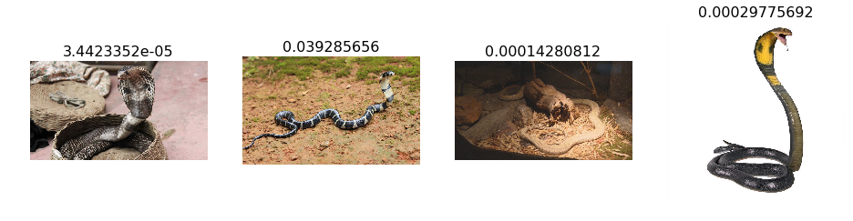
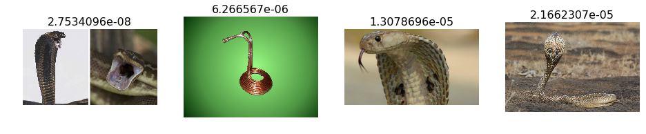
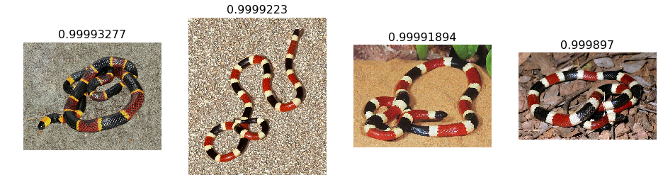
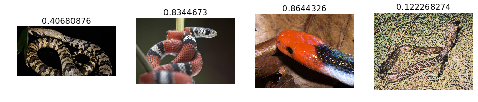
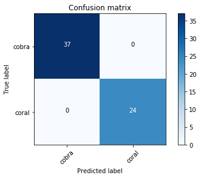

## Image classification with Convolutional Neural Networks

Welcome to the first week of the second deep learning certificate! We're going to use convolutional neural networks (CNNs) to allow our computer to see - something that is only possible thanks to deep learning.

## Reusando modelo resnet para clasificar cobras y viboras coralillo

Para reutilizar el codigo usado en la primera lección de fastai, se toma en cuenta que el modelo preentrenado resnet34, puede ser usado para clasificar objetos similares (tamaño y forma), y sin tener que gastar tiempo de entrenamiento, podemos solo reentrenar una capa adicional.

Para obtener las imagenes para este ejemplo se uso el complemento "Google Image Downloader", el cual se puede bajar desde aqui

https://addons.mozilla.org/en-US/firefox/addon/google-images-downloader/?src=recommended

Este addon es muy conveniente para poder conseguir de una manera rapida imagenes parar armar nuestro set de entrenamiento y prueba, aproximadamente se descaragaron como 180 imagenes de cada clase, y se tomo una particion de 80 y 20 por ciento.

Se acomodo en 2 carpetas que es como espera el codigo que se encuentren y en sus respectivas carpetas de train y valid

Ya teniendo las imagenes las modificaciones al codigo son minimas (solo cambiar rutas), el proceso es muy rapido debido al pequeño numero de imagenes y que estamos usando un modelo preentrenado.

De aqui en delante sigue la parte tomada del python notebook de fastai, levemente modificada

We're going to try to create a model to enter the Dogs vs Cats competition at Kaggle. There are 25,000 labelled dog and cat photos available for training, and 12,500 in the test set that we have to try to label for this competition. According to the Kaggle web-site, when this competition was launched (end of 2013): "State of the art: The current literature suggests machine classifiers can score above 80% accuracy on this task". So if we can beat 80%, then we will be at the cutting edge as of 2013!


```python
# Put these at the top of every notebook, to get automatic reloading and inline plotting
%reload_ext autoreload
%autoreload 2
%matplotlib inline
```

Here we import the libraries we need. We'll learn about what each does during the course.


```python
# This file contains all the main external libs we'll use
from fastai.imports import *
```


```python
from fastai.transforms import *
from fastai.conv_learner import *
from fastai.model import *
from fastai.dataset import *
from fastai.sgdr import *
from fastai.plots import *
```

`PATH` is the path to your data - if you use the recommended setup approaches from the lesson, you won't need to change this. `sz` is the size that the images will be resized to in order to ensure that the training runs quickly. We'll be talking about this parameter a lot during the course. Leave it at `224` for now.


```python
PATH = "/home/adrianrdzv/Documentos/fastai/fastai/data/coralcobra/"
sz=224
```

It's important that you have a working NVidia GPU set up. The programming framework used to behind the scenes to work with NVidia GPUs is called CUDA. Therefore, you need to ensure the following line returns `True` before you proceed. If you have problems with this, please check the FAQ and ask for help on [the forums](http://forums.fast.ai).


```python
torch.cuda.is_available()
```


    True


In addition, NVidia provides special accelerated functions for deep learning in a package called CuDNN. Although not strictly necessary, it will improve training performance significantly, and is included by default in all supported fastai configurations. Therefore, if the following does not return `True`, you may want to look into why.


```python
torch.backends.cudnn.enabled
```


    True


## First look at coralillo pictures

Our library will assume that you have *train* and *valid* directories. It also assumes that each dir will have subdirs for each class you wish to recognize (in this case, 'cats' and 'dogs').


```python
os.listdir(PATH)
```


    ['valid', 'models', 'tmp', 'train']


```python
os.listdir(f'{PATH}valid')
```


    ['coral', 'cobra']


```python
files = os.listdir(f'{PATH}valid/coral')[:5]
files
```


    ['181.jpg', '177.jpg', '178.jpg', '188.jpg', '179.png']


```python
img = plt.imread(f'{PATH}valid/coral/{files[0]}')
plt.imshow(img);
```


Here is how the raw data looks like


```python
img.shape
```


    (925, 808, 3)


```python
img[:4,:4]
```


    array([[[250, 233, 205],
            [246, 234, 212],
            [255, 255, 241],
            [233, 234, 226]],
    
           [[255, 239, 211],
            [240, 225, 202],
            [245, 238, 220],
            [255, 255, 243]],
    
           [[255, 236, 209],
            [246, 230, 205],
            [228, 218, 193],
            [236, 231, 211]],
    
           [[255, 247, 220],
            [245, 228, 200],
            [239, 225, 198],
            [255, 250, 223]]], dtype=uint8)


## Our first model: quick start

We're going to use a <b>pre-trained</b> model, that is, a model created by some one else to solve a different problem. Instead of building a model from scratch to solve a similar problem, we'll use a model trained on ImageNet (1.2 million images and 1000 classes) as a starting point. The model is a Convolutional Neural Network (CNN), a type of Neural Network that builds state-of-the-art models for computer vision. We'll be learning all about CNNs during this course.

We will be using the <b>resnet34</b> model. resnet34 is a version of the model that won the 2015 ImageNet competition. Here is more info on [resnet models](https://github.com/KaimingHe/deep-residual-networks). We'll be studying them in depth later, but for now we'll focus on using them effectively.

Here's how to train and evalulate a *dogs vs cats* model in 3 lines of code, and under 20 seconds:


```python
# Uncomment the below if you need to reset your precomputed activations
shutil.rmtree(f'{PATH}tmp', ignore_errors=True)
```


```python
arch=resnet34
data = ImageClassifierData.from_paths(PATH, tfms=tfms_from_model(arch, sz))
learn = ConvLearner.pretrained(arch, data, precompute=True)
learn.fit(0.01,5)
```

      0%|          | 0/5 [00:00<?, ?it/s]
    
    /home/adrianrdzv/Documentos/fastai/fastai/courses/dl1/fastai/initializers.py:6: UserWarning: nn.init.kaiming_normal is now deprecated in favor of nn.init.kaiming_normal_.
      if hasattr(m, 'weight'): init_fn(m.weight)


    100%|██████████| 5/5 [00:04<00:00,  1.10it/s]
    100%|██████████| 1/1 [00:02<00:00,  2.34s/it]


    HBox(children=(IntProgress(value=0, description='Epoch', max=5), HTML(value='')))


    epoch      trn_loss   val_loss   accuracy        
        0      0.693883   0.656781   0.622951  
        1      0.413677   0.195385   0.918033        
        2      0.300005   0.066919   0.967213        
        3      0.234414   0.03243    1.0             
        4      0.190416   0.023629   1.0             


    [0.023629428818821907, 1.0]


How good is this model? Well, as we mentioned, prior to this competition, the state of the art was 80% accuracy. But the competition resulted in a huge jump to 98.9% accuracy, with the author of a popular deep learning library winning the competition. Extraordinarily, less than 4 years later, we can now beat that result in seconds! Even last year in this same course, our initial model had 98.3% accuracy, which is nearly double the error we're getting just a year later, and that took around 10 minutes to compute.

## Analyzing results: looking at pictures

As well as looking at the overall metrics, it's also a good idea to look at examples of each of:
1. A few correct labels at random
2. A few incorrect labels at random
3. The most correct labels of each class (ie those with highest probability that are correct)
4. The most incorrect labels of each class (ie those with highest probability that are incorrect)
5. The most uncertain labels (ie those with probability closest to 0.5).


```python
# This is the label for a val data
data.val_y
```


    array([0, 0, 0, 0, 0, 0, 0, 0, 0, 0, 0, 0, 0, 0, 0, 0, 0, 0, 0, 0, 0, 0, 0, 0, 0, 0, 0, 0, 0, 0, 0, 0, 0, 0,
           0, 0, 0, 1, 1, 1, 1, 1, 1, 1, 1, 1, 1, 1, 1, 1, 1, 1, 1, 1, 1, 1, 1, 1, 1, 1, 1])


```python
# from here we know that 'cats' is label 0 and 'dogs' is label 1.
data.classes
```


    ['cobra', 'coral']


```python
# this gives prediction for validation set. Predictions are in log scale
log_preds = learn.predict()
log_preds.shape
```


    (61, 2)


```python
log_preds[:10]
```


    array([[ -0.00016,  -8.76311],
           [ -0.00092,  -6.9902 ],
           [ -0.00368,  -5.60685],
           [ -0.00014,  -8.85401],
           [  0.     , -17.40784],
           [ -0.00066,  -7.32958],
           [ -0.00003, -10.27678],
           [ -0.0001 ,  -9.17988],
           [ -0.13041,  -2.10154],
           [ -0.05915,  -2.85704]], dtype=float32)


```python
preds = np.argmax(log_preds, axis=1)  # from log probabilities to 0 or 1
probs = np.exp(log_preds[:,1])        # pr(dog)
```


```python
def rand_by_mask(mask): return np.random.choice(np.where(mask)[0], 4, replace=False)
def rand_by_correct(is_correct): return rand_by_mask((preds == data.val_y)==is_correct)
```


```python
def plot_val_with_title(idxs, title):
    imgs = np.stack([data.val_ds[x][0] for x in idxs])
    title_probs = [probs[x] for x in idxs]
    print(title)
    return plots(data.val_ds.denorm(imgs), rows=1, titles=title_probs)
```


```python
def plots(ims, figsize=(12,6), rows=1, titles=None):
    f = plt.figure(figsize=figsize)
    for i in range(len(ims)):
        sp = f.add_subplot(rows, len(ims)//rows, i+1)
        sp.axis('Off')
        if titles is not None: sp.set_title(titles[i], fontsize=16)
        plt.imshow(ims[i])
```


```python
def load_img_id(ds, idx): return np.array(PIL.Image.open(PATH+ds.fnames[idx]))

def plot_val_with_title(idxs, title):
    imgs = [load_img_id(data.val_ds,x) for x in idxs]
    title_probs = [probs[x] for x in idxs]
    print(title)
    return plots(imgs, rows=1, titles=title_probs, figsize=(16,8))
```


```python
# 1. A few correct labels at random
plot_val_with_title(rand_by_correct(True), "Correctly classified")
```

    Correctly classified





```python
# 2. A few incorrect labels at random
plot_val_with_title(rand_by_correct(False), "Incorrectly classified")
```


    ---------------------------------------------------------------------------
    
    ValueError                                Traceback (most recent call last)
    
    <ipython-input-75-b262289da2a3> in <module>()
          1 # 2. A few incorrect labels at random
    ----> 2 plot_val_with_title(rand_by_correct(False), "Incorrectly classified")


    <ipython-input-69-ad50c0dec906> in rand_by_correct(is_correct)
          1 def rand_by_mask(mask): return np.random.choice(np.where(mask)[0], 4, replace=False)
    ----> 2 def rand_by_correct(is_correct): return rand_by_mask((preds == data.val_y)==is_correct)


    <ipython-input-69-ad50c0dec906> in rand_by_mask(mask)
    ----> 1 def rand_by_mask(mask): return np.random.choice(np.where(mask)[0], 4, replace=False)
          2 def rand_by_correct(is_correct): return rand_by_mask((preds == data.val_y)==is_correct)


    mtrand.pyx in mtrand.RandomState.choice()


    ValueError: a must be non-empty


```python
def most_by_mask(mask, mult):
    idxs = np.where(mask)[0]
    return idxs[np.argsort(mult * probs[idxs])[:4]]

def most_by_correct(y, is_correct): 
    mult = -1 if (y==1)==is_correct else 1
    return most_by_mask(((preds == data.val_y)==is_correct) & (data.val_y == y), mult)
```


```python
plot_val_with_title(most_by_correct(0, True), "Most correct cobra")
```

    Most correct cobra





```python
plot_val_with_title(most_by_correct(1, True), "Most correct coral")
```

    Most correct coral





```python
plot_val_with_title(most_by_correct(0, False), "Most incorrect cobras")
```

    Most incorrect cobras


    <Figure size 1152x576 with 0 Axes>


```python
plot_val_with_title(most_by_correct(1, False), "Most incorrect coral")
```

    Most incorrect coral


    <Figure size 1152x576 with 0 Axes>


```python
most_uncertain = np.argsort(np.abs(probs -0.5))[:4]
plot_val_with_title(most_uncertain, "Most uncertain predictions")
```

    Most uncertain predictions





```python
from sklearn.metrics import confusion_matrix
cm = confusion_matrix(data.val_y, preds)
```

We can just print out the confusion matrix, or we can show a graphical view (which is mainly useful for dependents with a larger number of categories).


```python
plot_confusion_matrix(cm, data.classes)
```

    [[37  0]
     [ 0 24]]




